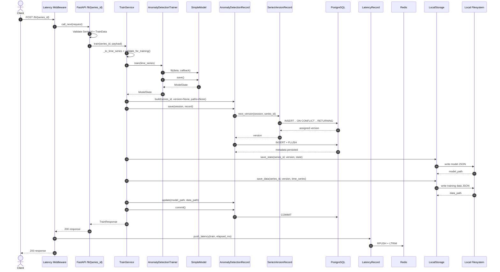
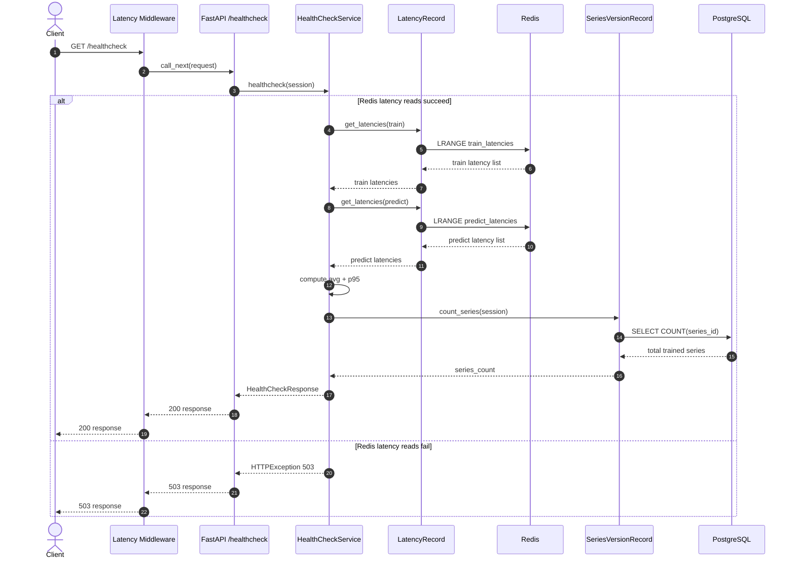
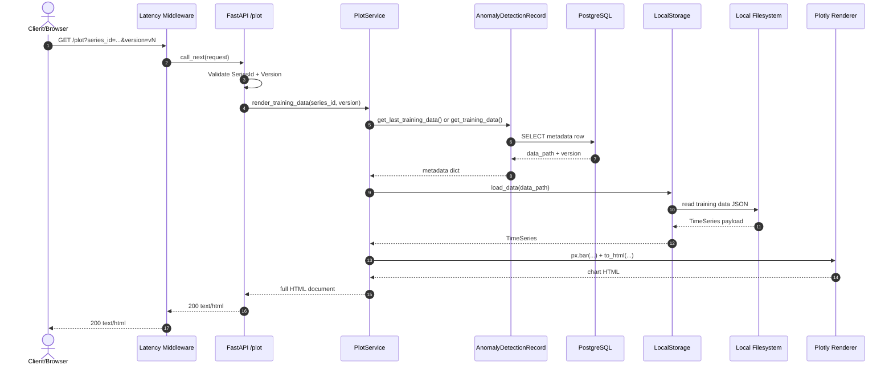

# Anomaly Detection API Architecture

This project provides an API for univariate time-series anomaly detection across multiple series, supporting a full lifecycle: training from historical data, persisting versioned models, and serving predictions. The architecture separates concerns into API (validation and contracts), services (orchestration and error mapping), core (model and trainer abstractions), and persistence (PostgreSQL metadata, Redis telemetry, and filesystem artifacts).

The codebase is designed around dependency injection: routes import a service and pass dependencies into it (such as model, trainer, storage, and session). This keeps components swappable, easier to test, and less coupled to specific infrastructure implementations.

## 🎯 Scope

This document describes the current project structure and runtime flow for:
- `POST /fit/{series_id}`
- `POST /predict/{series_id}`
- `GET /healthcheck`
- `GET /plot`

## 🗂️ Project Structure

This section provides a map of the repository organization so each module can be located. 

```text
app/
  api/        # FastAPI route handlers
  middleware/ # Request latency middleware
  services/   # Application use-cases
  core/       # Model, trainer abstractions and implementation
  schemas/    # Request/response/domain validation models
  storage/    # Storage interface + local filesystem adapter
  database/   # ORM entities and query helpers
  db.py       # Engine and session configuration
  main.py     # App bootstrap and route registration
```
 
## 🧱 Layer Responsibilities

The system follows a layered architecture where each layer has a clear responsibility and communicates through boundaries. Request flow moves from API to services, then to core logic and persistence adapters, which keeps business rules centralized and infrastructure concerns decoupled from HTTP handling.

- **API layer** (`app/api/*.py`):
  - Validates path/query/body input with Pydantic/FastAPI.
  - Instantiates service objects and returns typed responses.
- **Service layer** (`app/services/*.py`):
  - Contains use-case logic and exception mapping to HTTP status codes.
- **Core layer** (`app/core/*.py`):
  - Model contract (`Model`), trainer contract (`Trainer`), and `SimpleModel`.
- **Schema layer** (`app/schemas/*.py`):
  - Input validation and conversion (`TrainData -> TimeSeries`, `PredictData -> DataPoint`).
- **Persistence layer**:
  - Database metadata: `app/database/*.py`.
  - Redis latency cache access: `app/database/latency.py`.
  - Artifact storage: `app/storage/local_storage.py`.
  - Session lifecycle: `app/db.py`.
- **Middleware** (`app/middleware/latency.py`):
  - Tracks latency for successful `/fit/*` and `/predict/*` requests.
  - Stores raw latency samples in Redis (bounded history via list trim).

## 🧩 Runtime Components

This section summarizes the components that are active during execution and how they collaborate per request. It shows how the app bootstrap, middleware, services, and persistence and storage adapters interact from request entry to response output.

- **App bootstrap**: `app/main.py`
  - Registers routers: train, predict, healthcheck, plot.
  - Attaches middleware: `track_request_latency`.
- **Services**:
  - `TrainService` orchestrates training + metadata + artifact writes.
  - `PredictService` resolves metadata and artifact and performs prediction.
  - `HealthCheckService` reads Redis raw latencies and computes avg and P95 when telemetry is available; otherwise returns HTTP `503`.
  - `PlotService` resolves training data and renders Plotly HTML.
- **Database entities**:
  - `AnomalyDetectionRecord` in `anomaly_detection_models`.
  - `SeriesVersionRecord` in `series_versions`.
  - `LatencyRecord` in Redis lists (`train_latencies`, `predict_latencies`).

## 🔀 Endpoint Flows

This section describes the end-to-end behavior of each public endpoint, from request validation to service orchestration, persistence access, and final response. It provides a step-by-step view of the runtime path for training, prediction, healthcheck, and plot rendering.

### `POST /fit/{series_id}`

1. Route validates `series_id` and `TrainData`.
2. Service converts to `TimeSeries` and runs training preflight validation.
3. Trainer calls model fit, then returns model state.
4. Metadata row is created and version is assigned atomically when needed.
5. Model state and training data are persisted as JSON artifacts.
6. Metadata paths are updated, transaction is committed, and `TrainResponse` is returned.

### `POST /predict/{series_id}`

1. Route validates `series_id`, `PredictData`, and query `version`.
2. Version is normalized (`0`, `1`, `v1`, `V1` supported).
3. Service resolves latest/specific model metadata.
4. Service loads model artifact, restores model state, and predicts anomaly.
5. `PredictResponse` returns anomaly flag and resolved model version.

### `GET /healthcheck`

1. Reads raw latency values from Redis lists (`train_latencies`, `predict_latencies`).
2. If Redis reads fail, returns HTTP `503` with telemetry-unavailable detail.
3. Otherwise computes average and P95 in `HealthCheckService`.
4. Counts trained series from `series_versions`.
5. Returns latency metrics and trained-series counter.

### `GET /plot`

1. Route validates `series_id` and query `version` (supports `0`, `1`, `v1`, `V1`).
2. Service resolves latest/specific training-data metadata (`data_path`).
3. Service loads persisted training data from local storage.
4. Service renders a Plotly bar chart and returns HTML.

## 📊 Training Sequence Diagram

The same diagram is also available at `docs/training-sequence.mmd`.
An equivalent copy focused on `/fit` naming is available at `docs/fit-sequence.mmd`.



## 📊 Fit Sequence Diagram

The same diagram is also available at `docs/fit-sequence.mmd`.


## 📊 Healthcheck Sequence Diagram

The same diagram is also available at `docs/healthcheck-sequence.mmd`.



## 📊 Plot View Flow Diagram

The same diagram is also available at `docs/plot-view-flow.mmd`.



## 📊 Validation Rules

Validation is applied in layers to reject invalid input as early as possible and keep domain logic consistent. Route and schema validation enforce request format and basic type constraints, while domain-level checks (for example time-ordering and training preconditions) enforce business invariants before persistence or model execution.

- `SeriesId`: non-empty, trimmed, regex `[A-Za-z0-9._-]+`, rejects `..`
- `TrainData`: non-negative integer timestamps, finite numeric values, same length arrays
- `TimeSeries`: at least 2 points, strictly increasing timestamps
- `PredictData`: timestamp is non-empty digits-only string, value is finite numeric
- `Version`: accepts digits with optional `v`/`V` prefix


## 💾 Persistence and Versioning

Persistence is split into metadata history and series version counters to ensure both traceability and concurrency safety. Metadata rows keep the full versioned history, while a dedicated series-version table allocates the next version atomically under concurrent training requests.

- `anomaly_detection_models`:
  - primary key: `(series_id, version)`
  - stores `model_path`, `data_path`, `created_at`, `updated_at`
- `series_versions`:
  - primary key: `series_id`
  - stores `last_version`
- **Version increment strategy**:
  - PostgreSQL upsert with `RETURNING` to ensure atomic version allocation

## 💿 Artifact Storage

Model state and training data are persisted as versioned JSON artifacts in a deterministic folder structure. Database metadata stores the resolved artifact paths, while environment variable fallbacks define the effective storage roots.

- **Model state path pattern**:
  - `./data/models/<series_id>/<series_id>_model_v<version>.json`
- **Training data path pattern**:
  - `./data/data/<series_id>/<series_id>_data_v<version>.json`
- **Folder resolution precedence**:
  - model state: `MODEL_STATE_FOLDER` -> `MODEL_FOLDER` -> default `./data/models`
  - training data: `TRAINING_DATA_FOLDER` -> `DATA_FOLDER` -> default `./data/data`

## ⚙️ Configuration Defaults

Default configuration values provide a local development baseline for database access, telemetry retention, training constraints, and storage paths. In production, these values are expected to be overridden by environment variables to match infrastructure and capacity requirements.

- `DATABASE_URL`: `postgresql+psycopg2://postgres:postgres@db:5432/postgres`
- `MIN_TRAINING_DATA_POINTS`: `3`
- `REDIS_URL`: `redis://redis:6379/0`
- `LATENCY_HISTORY_LIMIT`: `100`
- **Storage fallback folders**:
  - model state: `./data/models`
  - training data: `./data/data`

## ❌ Error Behavior

Error handling maps validation, domain, and infrastructure failures into stable HTTP responses so clients get predictable contracts and operators get safer failure semantics. The service layer centralizes this mapping, including rollback behavior for transactional operations and explicit handling for missing metadata/artifacts.

- **Training**:
  - validation/preflight errors -> HTTP `422`
  - `ValidationError` and `ValueError` details use list-shaped payloads
  - unexpected runtime errors -> HTTP `500`
  - session rollback before re-raising failures
- **Prediction**:
  - invalid inputs -> HTTP `422` or `400` (service defensive checks)
  - missing metadata/artifact -> HTTP `404`
  - missing `model_path` or unexpected errors -> HTTP `500`
- **Latency healthcheck**:
  - middleware Redis write failures are logged and ignored (request still succeeds)
  - healthcheck Redis read failures return HTTP `503`
