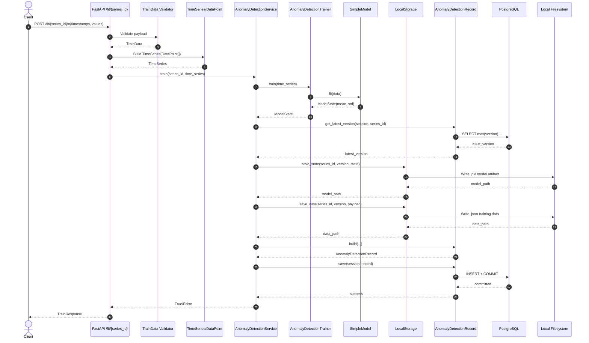

# Anomaly Detection API Architecture

## Scope
This document maps how data flows through the project when training a model via `POST /fit/{series_id}`.

## Runtime Components
- `FastAPI app` (`app/main.py`): boots the API and registers routes.
- `Train API route` (`app/api/train.py`): handles request validation + orchestration handoff.
- `API schemas` (`app/api/schema.py`): validates external payload (`timestamps`, `values`).
- `Core schemas` (`app/core/schema.py`): validates internal domain objects (`TimeSeries`, `DataPoint`, `ModelState`).
- `Service` (`app/services/anomaly_detection_service.py`): coordinates training + persistence.
- `Trainer` (`app/core/trainer.py`): delegates fitting to a model implementation.
- `Model` (`app/core/model.py`): computes `mean` and `std` and serializes model state.
- `Local storage repository` (`app/repositories/local_storage.py`): writes model/data artifacts to disk.
- `Database model + helpers` (`app/database/anomaly_detection_record.py`): version lookup, record creation, commit.
- `DB session factory` (`app/db.py`): SQLAlchemy engine/session lifecycle.
- `PostgreSQL` (via `docker-compose.yml` + migrations): stores model metadata and artifact paths.

## Layered View
1. API Layer:
- `app/main.py`
- `app/api/train.py`
- `app/api/schema.py`

2. Application/Service Layer:
- `app/services/anomaly_detection_service.py`

3. Domain/Core Layer:
- `app/core/trainer.py`
- `app/core/model.py`
- `app/core/schema.py`

4. Infrastructure Layer:
- `app/repositories/local_storage.py`
- `app/database/anomaly_detection_record.py`
- `app/db.py`
- `migrations/*`, `alembic.ini`, `docker-compose.yml`

## Training Flow
1. Client calls `POST /fit/{series_id}` with `timestamps` and `values`.
2. `TrainData` validates type/shape/length constraints and min points.
3. Route maps payload into `TimeSeries(data=[DataPoint(...)])`.
4. `AnomalyDetectionService.train()` calls trainer/model `fit`.
5. `SimpleModel.fit()` computes `mean` and `std` and emits `ModelState`.
6. Service fetches current series latest version from DB and computes next version.
7. Service writes:
- model state (`.pkl`) under `./data/models/<series_id>/...`
- input training payload (`.json`) under `./data/data/<series_id>/...`
8. Service builds and commits `anomaly_detection_models` record with artifact paths.
9. Route returns `TrainResponse { series_id, success, message }`.

## Sequence Diagram

## Data Contracts
- External request:
  - `timestamps: list[int]`
  - `values: list[float]`
- Internal training payload:
  - `TimeSeries.data: Sequence[DataPoint]`
  - `DataPoint.timestamp: int`
  - `DataPoint.value: float`
- Persisted metadata (`anomaly_detection_models`):
  - `series_id`, `version` (composite key)
  - `model_path`, `data_path`
  - `created_at`, `updated_at`

## Configuration and Defaults
- `DATABASE_URL`: defaults to `postgresql+psycopg2://postgres:postgres@db:5432/postgres`.
- `MIN_TRAINING_DATA_POINTS`: defaults to `3`.
- Storage folders (fallbacks):
  - model state: `./data/models`
  - training data: `./data/data`

## Failure Behavior
- `AnomalyDetectionService.train()` catches broad exceptions, rolls back the DB session, and returns `False`.
- API always responds with `TrainResponse`; `success=false` maps to `"Training failed."`.

