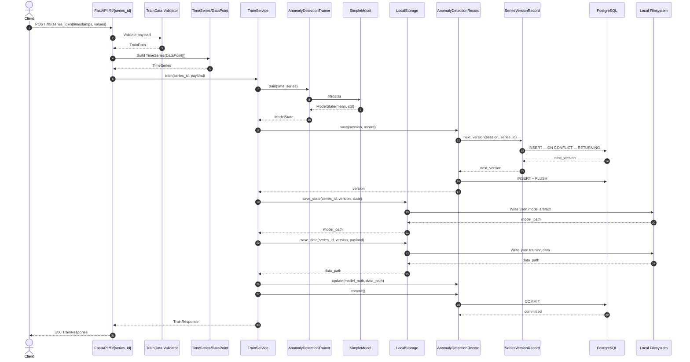

# Anomaly Detection API Architecture

## Scope
This document maps how data flows through the project when training a model via `POST /fit/{series_id}`

## Runtime Components
- `FastAPI app` (`app/main.py`): boots the API and registers routes
- `Train API route` (`app/api/train.py`): validates request shape and delegates to `TrainService`
- `Predict API route` (`app/api/predict.py`): validates request shape and delegates to `PredictService`
- `API/domain schemas` (`app/schemas/*.py`):
  - training input: `app/schemas/train_data.py`
  - prediction input: `app/schemas/predict_data.py`, `app/schemas/predict_version.py`
  - core domain models: `app/schemas/time_series.py`, `app/schemas/data_point.py`, `app/schemas/model_state.py`
  - route/path helpers: `app/schemas/series_id.py`, response models
- `Training service` (`app/services/train_service.py`): coordinates training, metadata persistence, artifact persistence
- `Prediction service` (`app/services/predict_service.py`): resolves model metadata/artifact and runs inference
- `Trainer` (`app/core/trainer.py`): delegates fitting to a model implementation
- `Model interface + implementation`:
  - `app/core/model.py`
  - `app/core/simple_model.py`
- `Storage repository`:
  - interface: `app/repositories/storage.py`
  - local implementation: `app/repositories/local_storage.py`
- `Database models + helpers`:
  - `app/database/anomaly_detection_record.py`: record creation, save, update, commit, lookup
  - `app/database/series_version_record.py`: atomic version assignment per series
- `DB session factory` (`app/db.py`): SQLAlchemy engine/session lifecycle
- `PostgreSQL` (via `docker-compose.yml` + migrations): stores model metadata and artifact paths

## Layered View
1. API Layer
- `app/main.py`
- `app/api/train.py`
- `app/api/predict.py`

2. Application/Service Layer
- `app/services/train_service.py`
- `app/services/predict_service.py`

3. Domain/Core Layer
- `app/schemas/train_data.py`
- `app/schemas/predict_data.py`
- `app/schemas/predict_version.py`
- `app/schemas/time_series.py`
- `app/schemas/data_point.py`
- `app/schemas/model_state.py`
- `app/core/trainer.py`
- `app/core/model.py`
- `app/core/simple_model.py`

4. Infrastructure Layer
- `app/repositories/storage.py`
- `app/repositories/local_storage.py`
- `app/database/anomaly_detection_record.py`
- `app/database/series_version_record.py`
- `app/db.py`
- `migrations/*`, `alembic.ini`, `docker-compose.yml`

## Training Flow
1. Client calls `POST /fit/{series_id}` with `timestamps` and `values`
2. Route validation runs on:
- `series_id` via `SeriesId` (`app/schemas/series_id.py`)
- payload shape/types via `TrainData` (`app/schemas/train_data.py`)
3. `TrainService._to_time_series()` converts payload into `TimeSeries(data=[DataPoint(...)])` and enforces training preflight constraints
4. `TrainService.train()` calls trainer/model fit and gets a `ModelState`
5. Service builds a DB record and persists it; version is assigned atomically via `SeriesVersionRecord.next_version()` when needed
6. Service writes artifacts as JSON files:
- model state under `./data/models/<series_id>/<series_id>_model_v<version>.json`
- training payload under `./data/data/<series_id>/<series_id>_data_v<version>.json`
7. Service updates record paths and commits the transaction
8. Route returns `TrainResponse { series_id, success=true, message }`

## Sequence Diagram

## Data Contracts
- External training request
  - `timestamps: list[int]`
  - `values: list[float]`
- Internal training payload
  - `TimeSeries.data: Sequence[DataPoint]`
  - `DataPoint.timestamp: int`
  - `DataPoint.value: float`
- Persisted metadata (`anomaly_detection_models`)
  - `series_id`, `version` (composite key)
  - `model_path`, `data_path`
  - `created_at`, `updated_at`

## Configuration and Defaults
- `DATABASE_URL`: defaults to `postgresql+psycopg2://postgres:postgres@db:5432/postgres`
- `MIN_TRAINING_DATA_POINTS`: defaults to `3`
- Storage folders (fallbacks)
  - model state: `./data/models`
  - training data: `./data/data`

## Failure Behavior
- Training payload validation and training preflight errors map to HTTP `422`
- Unexpected runtime failures map to HTTP `500`
- Service always rolls back DB session before re-raising handled exceptions

## API QA Execution Context
- API QA commands should be executed from container `time_series_anomaly_detection-db-1`
- From that container, call API endpoints through Docker DNS using `http://api:8000`
