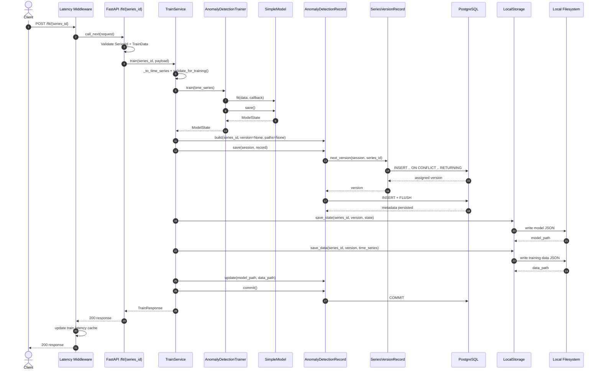

# Anomaly Detection API Architecture

## Scope

This document describes the current project structure and runtime flow for:
- `POST /fit/{series_id}`
- `POST /predict/{series_id}`
- `GET /healthcheck`

## Project Structure

```text
app/
  api/                # FastAPI route handlers
  middleware/         # Request latency middleware
  services/           # Application use-cases
  core/               # Model/trainer abstractions and implementation
  schemas/            # Request/response/domain validation models
  repositories/       # Storage interface + local filesystem adapter
  database/           # ORM entities and query helpers
  db.py               # Engine/session configuration
  main.py             # App bootstrap and route registration
docs/
  architecture.md
  training-sequence.mmd
migrations/
  versions/           # Alembic schema migrations
tests/                # API, service, schema, core and repository tests
data/                 # Persisted artifacts (models/data)
```

## Layer Responsibilities

- API layer (`app/api/*.py`)
  - Validates path/query/body input with Pydantic/FastAPI
  - Instantiates service objects and returns typed responses
- Service layer (`app/services/*.py`)
  - Contains use-case logic and exception mapping to HTTP status codes
- Core layer (`app/core/*.py`)
  - Model contract (`Model`), trainer contract (`Trainer`), and `SimpleModel`
- Schema layer (`app/schemas/*.py`)
  - Input validation and conversion (`TrainData -> TimeSeries`, `PredictData -> DataPoint`)
- Persistence layer
  - Database metadata: `app/database/*.py`
  - Artifact storage: `app/repositories/local_storage.py`
  - Session lifecycle: `app/db.py`
- Middleware (`app/middleware/latency.py`)
  - Tracks latency for successful `/fit/*` and `/predict/*` requests

## Runtime Components

- App bootstrap: `app/main.py`
  - Registers routers: train, predict, healthcheck
  - Attaches middleware: `track_request_latency`
- Services:
  - `TrainService` orchestrates training + metadata + artifact writes
  - `PredictService` resolves metadata/artifact and performs prediction
  - `HealthCheckService` returns trained-series count and latency metrics
- Database entities:
  - `AnomalyDetectionRecord` in `anomaly_detection_models`
  - `SeriesVersionRecord` in `series_versions`

## Endpoint Flows

### `POST /fit/{series_id}`

1. Route validates `series_id` and `TrainData`.
2. Service converts to `TimeSeries` and runs training preflight validation.
3. Trainer calls model fit, then returns model state.
4. Metadata row is created and version is assigned atomically when needed.
5. Model state and training data are persisted as JSON artifacts.
6. Metadata paths are updated, transaction is committed, and `TrainResponse` is returned.

### `POST /predict/{series_id}`

1. Route validates `series_id`, `PredictData`, and query `version`.
2. Version is normalized (`0`, `1`, `v1`, `V1` supported).
3. Service resolves latest/specific model metadata.
4. Service loads model artifact, restores model state, and predicts anomaly.
5. `PredictResponse` returns anomaly flag and resolved model version.

### `GET /healthcheck`

1. Reads in-memory latency cache.
2. Counts trained series from `series_versions`.
3. Returns average and P95 for training/inference latency.

## Training Sequence Diagram

The same diagram is also available at `docs/training-sequence.mmd`.



## Validation Rules

- `SeriesId`: non-empty, trimmed, regex `[A-Za-z0-9._-]+`, rejects `..`
- `TrainData`: non-negative integer timestamps, finite numeric values, same length arrays
- `TimeSeries`: at least 2 points, strictly increasing timestamps
- `PredictData`: timestamp is non-empty digits-only string, value is finite numeric
- `PredictVersion`: accepts digits with optional `v`/`V` prefix

## Persistence and Versioning

- `anomaly_detection_models`
  - primary key: `(series_id, version)`
  - stores `model_path`, `data_path`, `created_at`, `updated_at`
- `series_versions`
  - primary key: `series_id`
  - stores `last_version`
- Version increment strategy:
  - PostgreSQL upsert with `RETURNING` to ensure atomic version allocation

## Artifact Storage

- Model state path pattern:
  - `./data/models/<series_id>/<series_id>_model_v<version>.json`
- Training data path pattern:
  - `./data/data/<series_id>/<series_id>_data_v<version>.json`
- Folder resolution precedence:
  - params dict keys
  - environment variables
  - fallback defaults

## Configuration Defaults

- `DATABASE_URL`: `postgresql+psycopg2://postgres:postgres@db:5432/postgres`
- `MIN_TRAINING_DATA_POINTS`: `3`
- Storage fallback folders:
  - model state: `./data/models`
  - training data: `./data/data`

## Error Behavior

- Training:
  - validation/preflight errors -> HTTP `422`
  - unexpected runtime errors -> HTTP `500`
  - session rollback before re-raising failures
- Prediction:
  - invalid inputs -> HTTP `422` or `400` (service defensive checks)
  - missing metadata/artifact -> HTTP `404`
  - missing `model_path` or unexpected errors -> HTTP `500`
